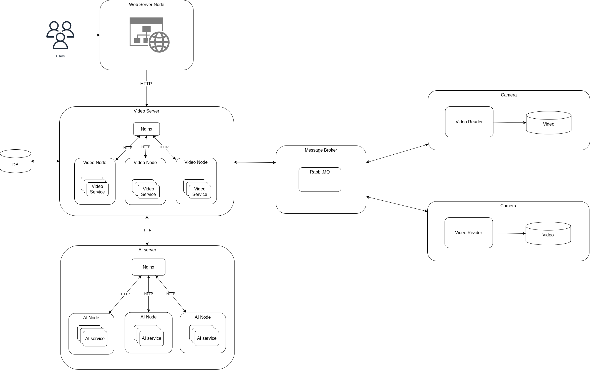

# Centralized Architecture for Video Streaming
<!-- ABOUT THE PROJECT -->
## About The Project

This project is based on the code in the main branch, but with brand new architecture 
## Getting Started
### Prerequisites
**Docker**

You must have the all the required docker components to run this project

How to setup docker: https://docs.docker.com/engine/install/ubuntu/

**Virtual machine**

You must setup at least 2 virtual machines cause we gonna setup an swarm environment in docker.

## Installation
1. Clone this repo and switch to newArchitecture branch
 
        git clone https://github.com/truongvanhuy2000/videoStreaming
        git checkout newArchitecture

2. Set up a local registry for your swarm

       docker service create --name registry --publish published=3500,target=5000 registry:2

3. Build the image and push to the local registry. Remember to change directory to videoStreaming folder

        make build
        make push

3. Deploy to swarm

        make stackdeploy

4. Access the Website to view streamed video

    By default, the website will be bound to port 5000 of the top manager node.
    The address of the website is:
        
        <ipaddress>:5000
    
