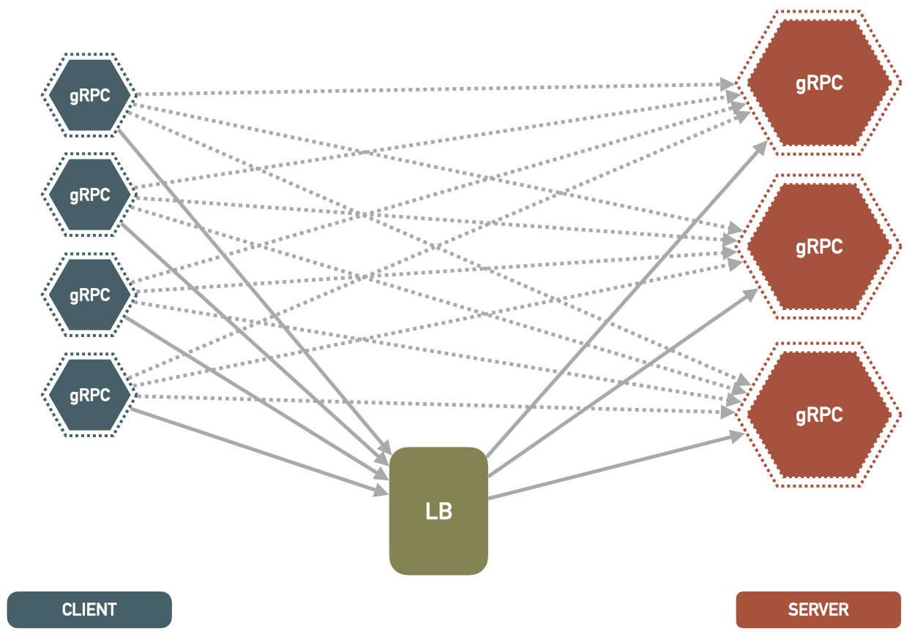

# Load Balancer investigation for Video Streaming
<!-- ABOUT THE PROJECT -->
## About The Project



This project is based on the code in the main branch, but it now includes a load balancer. For each request on the website, the load balancer creates a new service on a node based on a balancing algorithm. Afterwards, it forwards the information about the new service back to the web server. You can read more about this design in this blog: https://majidfn.com/blog/grpc-load-balancing/ 
## Getting Started
### Prerequisites
**NFS Server**

You must have a NFS server running on your host machine in order for this project to run. And the mount directory should include some videos for streaming purpose, you can use 4 example videos provided in this project.

How to set up an NFS server: https://ubuntu.com/server/docs/service-nfs

**Docker**

You must have the all the required docker components to run this project

How to setup docker: https://docs.docker.com/engine/install/ubuntu/

**Virtual machine**

You must setup at least 2 virtual machines cause we gonna setup an swarm environment in docker.

**Docker NFS volume**
You must set up a nfs volume on every node in the swarm. The configuration for the volume must be like this. You must change the <<NFS_SERVER_IP>> according to your setup. Remember to change this inside the docker compose file

      volumes:
        nfsvolume:
          driver: local
          driver_opts:
            type: "nfs"
            o: "addr=<<NFS_SERVER_IP>>,nfsvers=4.1,nolock,soft,rw"
            device: ":home/huy/Videos"
          name: "nfsvolume"

## Installation
1. Clone this repo and switch to loadBalancerInvestigation branch
 
        git clone https://github.com/truongvanhuy2000/videoStreaming
        git checkout loadBalancerInvestigation

2. Set up a local registry for your swarm

       docker service create --name registry --publish published=3500,target=5000 registry:2

3. Build the image and push to the local registry. Remember to change directory to videoStreaming folder

        make build
        make push

3. Deploy to swarm

        make stackdeploy

4. Access the Website to view streamed video

    By default, the website will be bound to port 5000 of the top manager node.
    The address of the website is:
        
        <ipaddress>:5000
    
    **Website Layout**

    This is basically the same as the one at main branch. Just need to know that each video is corresponding to a service on a node

    

## Project Structure

Aside from the inclusion of LoadBalancerApp, the folder structure of everything else remains largely the same. Therefore, I won't discuss them here, and instead, I recommend you review the main branch for further details.

+ **loadBalancerApp**

  ```sh
    ├── Dockerfile              # This is used to build the docker image
    ├── loadBalancer            # This is where all the magic reside
    │   ├── common              # Used for various purpose
    │   ├── service             # This run the load balancer service
    │   ├── dockerClient        # This will be used for connect to the docker daemon
    │   ├── __init__.py         # Used to indicate that this is a python module
    │   ├── __main__.py         # :))
    │   └── app.py              # Used to start the whole thing
    ├── test                    # Some basic testing for this, but i didn't touch it that much
    ├── .dockerignore           # Ignore some unnecessary things 
    ├── Makefile                # Shortcut for some command in here
    ├── balancer.env            # Some environment variable, you should adjust this based on your need
    └── requirements.txt        # Python required dependencies

    ```