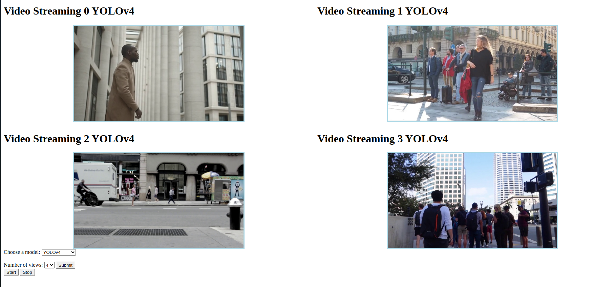

# Video Streaming Project
<!-- ABOUT THE PROJECT -->
## About The Project



This project is used for create a web server to display videos streamed from a video server. User can choose which model AI to use and how many video window that can be played simultaneously.

This project is created for the purpose of learning only, so read this with the grain of salt. 

## Getting Started
### Prerequisites
**NFS Server**

You must have a NFS server running on your host machine in order for this project to run. And the mount directory should include some videos for streaming purpose, you can use 4 example videos provided in this project.

How to set up an NFS server: https://ubuntu.com/server/docs/service-nfs

**Docker**

You must have the all the required docker components to run this project

How to setup docker: https://docs.docker.com/engine/install/ubuntu/

**Virtual machine**

You must setup at least 2 virtual machines cause we gonna setup an swarm environment in docker.

## Installation
1. Clone this repo
 
        git clone https://github.com/truongvanhuy2000/videoStreaming

2. Change the IP address and mount directory inside of the docker-compose file

        volumes:
          nfsvolume:
              driver: local
              driver_opts:
              type: "nfs"
              o: "addr=<<NFS_SERVER_IP>>,nfsvers=4.1,nolock,soft,rw"
              device: ":<<MOUNT_DIR>>"
        
3. Run the project

    There are 2 way you can run this project:
    
    + **Standlone mode**

    In this mode, you will run everything on a single machine
            
        docker compose up
    
    + **Docker Swarm mode**

    In this mode, you will run everything on different machine

        docker stack deploy --compose-file docker-compose.yml demo

4. Access the Website to view streamed video

    By default, the website will be bound to port 8000 of the machine that you ran the command on.
    The address of the website is:
        
        <ipaddress>:8000
    
    **Website Layout**

    I won't explain the functionality of the website so you should try to play around for a little bit.

    

## Project Structure

In this part, i will talk briefly about the folder structure of this project and the functionality of its components.

### Top-level directory layout
```sh
.
├── videoServerApp          # Source code for the video server
├── webServerApp            # Source code for the web server
├── ExampleVideo            # Some example video that's displayed on the website
├── video.env               # Environment variable for video server, you can change protocol and mount directory here
├── web.env                 # Environment variable for web server, you can used this to change the address of video server
├── .gitignore
├── docker-compose.yml
└── README.md
```
  Everything else is self explanatory so im gonna focus on the 2 main components that are **videoServerApp** and **webServerApp**. They are mostly similar in term of components

+ **videoServerApp**

  ```sh
    ├── Dockerfile              # This is used to build the docker image
    ├── videoServer             # This is where all the magic reside
    │   ├── aiModel             # Used for loading AI models and use them
    │   ├── common              # Used for various purpose 
    │   ├── proto               # Proto file and protobuf API
    │   ├── service             # Main service of this project, simulate IO read on a camera server
    │   ├── transportation      # Various type of transportation protocol is stored here
    │   ├── __init__.py         # Used to indicate that this is a python module
    │   ├── __main__.py         # :))
    │   └── app.py              # Used to start the whole thing
    ├── .dockerignore           # Ignore some unnecessary things 
    ├── entrypoint.sh           # Script that run at container startup
    └── requirements.txt        # Python required dependencies
    ```

+ **webServerApp**

  ```sh
    ├── Dockerfile              # This is used to build the docker image
    ├── webServer               # This is where all the magic reside
    │   ├── db                  # Store the persistance database
    │   ├── common              # Used for various purpose
    │   ├── proto               # Proto file and protobuf API
    │   ├── service             # Main service of this project, run the website
    │   ├── transportation      # Various type of transportation protocol is stored here
    │   ├── __init__.py         # Used to indicate that this is a python module
    │   ├── __main__.py         # :))
    │   └── app.py              # Used to start the whole thing
    ├── .dockerignore           # Ignore some unnecessary things 
    └── requirements.txt        # Python required dependencies
    ```

    <p align="right">(<a href="#readme-top">back to top</a>)</p>